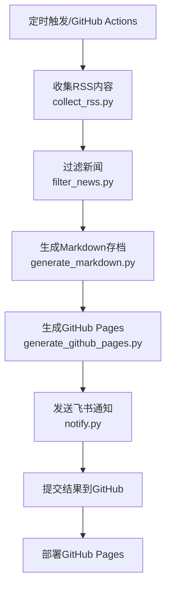

# 🚀 RSS 智能新闻聚合与通知系统

## 📋 项目简介
一个基于Python的RSS新闻自动收集、智能筛选和多渠道通知系统。支持GitHub Actions自动化运行，飞书消息推送，以及GitHub Pages实时展示。

## ✨ 核心功能

### 🎯 智能收集与筛选
- **多源RSS聚合**：支持多个RSS源同时收集
- **关键词智能筛选**：基于可配置关键词进行内容过滤
- **实时数据更新**：每6小时自动更新最新内容
- **历史数据归档**：自动保存历史新闻数据

### 📱 多渠道通知
- **飞书群聊通知**：支持卡片和文本两种消息格式
- **GitHub Pages展示**：响应式网页实时展示筛选结果
- **邮件通知**：可扩展支持邮件推送（预留接口）

### 🔄 自动化运维
- **GitHub Actions**：完全自动化运行，无需人工干预
- **自动部署**：代码更新自动部署到GitHub Pages
- **错误监控**：运行异常自动记录和通知

## 🏗️ 项目架构

```
├── .github/
│   └── workflows/
│       ├── rss-collector.yml      # 主工作流：RSS收集+筛选+通知
│       └── pages-deploy.yml       # GitHub Pages部署工作流
├── config/
│   ├── keywords.json             # 关键词配置
│   ├── rss-sources.json          # RSS源配置
│   └── feishu.json              # 飞书通知配置
├── src/
│   ├── collect_rss.py           # RSS内容收集
│   ├── filter_news.py           # 内容筛选
│   ├── generate_markdown.py     # Markdown报告生成
│   ├── generate_github_pages.py # GitHub Pages生成
│   ├── feishu_notifier.py       # 飞书通知模块
│   ├── notify.py                # 通知集成
│   └── utils.py                 # 工具函数
├── docs/                        # GitHub Pages静态文件
│   ├── index.html              # 主展示页面
│   ├── style.css               # 页面样式
│   └── script.js               # 交互脚本
├── output/                      # 输出文件
│   ├── raw_news.json           # 原始新闻数据
│   ├── filtered_news.json      # 筛选后新闻
│   ├── summary.json            # 统计摘要
│   ├── raw_news.md             # 原始新闻Markdown
│   ├── filtered_news.md        # 筛选新闻Markdown
│   └── archive/                # 历史归档
├── run.py                      # 一键运行脚本
├── setup_github_pages.py       # GitHub Pages初始化
├── test_feishu.py              # 飞书通知测试
├── requirements.txt            # 依赖列表
└── README.md                   # 项目说明
```

## 🔄 工作流程



## 🚀 快速开始

### 1️⃣ 一键部署
```bash
# 克隆项目
git clone https://github.com/hesievan/news-rss.git
cd news-rss

# 安装依赖
pip install -r requirements.txt

# 运行完整流程
python run.py
```

### 2️⃣ GitHub Pages部署
1. Fork本项目到你的GitHub账户
2. 进入仓库 Settings → Pages
3. Source选择 "GitHub Actions"
4. 工作流会自动部署，访问地址：`https://[你的用户名].github.io/news-rss`

### 3️⃣ 飞书通知配置
#### 创建飞书机器人
1. 飞书群聊 → 设置 → 群机器人 → 添加机器人 → 自定义机器人
2. 复制webhook地址（格式：`https://open.feishu.cn/open-apis/bot/v2/hook/xxx`）

#### 配置webhook
**方式A：GitHub Secrets（推荐）**
- 仓库 Settings → Secrets and variables → Actions
- 新建 secret：`FEISHU_WEBHOOK_URL=你的webhook地址`

**方式B：本地配置**
编辑 `config/feishu.json`:
```json
{
  "webhook_url": "https://open.feishu.cn/open-apis/bot/v2/hook/xxx",
  "notification_settings": {
    "enabled": true,
    "message_type": "card",
    "max_news_per_message": 10,
    "include_summary": true
  }
}
```

## ⚙️ 配置文件说明

### RSS源配置 (`config/rss-sources.json`)
```json
[
  {
    "name": "36氪",
    "url": "https://36kr.com/feed",
    "category": "科技",
    "enabled": true  // 新增: 手动启用/禁用开关
  },
  {
    "name": "Solidot",
    "url": "https://www.solidot.org/index.rss",
    "category": "科技",
    "enabled": true
  }
]
```

### 健康检查配置 (`config/health-check.json`) // 新增: 健康检查配置说明
```json
{
  "enabled": false,          // 是否启用健康检查
  "failure_threshold": 3,    // 失败阈值，连续失败多少次后禁用
  "check_interval_hours": 24, // 检查间隔(小时)
  "timeout_seconds": 10,     // 请求超时时间(秒)
  "auto_disable": true       // 是否自动禁用失败源
}
```

### 关键词配置 (`config/keywords.json`)
```json
{
  "include_keywords": ["AI", "人工智能", "机器学习", "区块链", "Web3"],
  "exclude_keywords": ["广告", "推广"],
  "min_score": 2
}
```

## 📊 数据展示

### GitHub Pages功能
- **实时统计**：文章数量、关键词分布、来源统计
- **智能分组**：按关键词和来源分组展示
- **响应式设计**：完美支持手机和桌面
- **一键直达**：点击标题直接访问原文

### 消息通知样式
```
📰 每日科技资讯 - 2025-07-24

📊 今日摘要
• 收集 156 条新闻
• 筛选 23 条相关
• 来源 5 个站点
• 匹配 8 个关键词

🏷️ AI人工智能 (8条)
1. OpenAI发布GPT-5...
2. 谷歌推出新AI框架...

🏷️ 区块链 (5条)
1. 以太坊完成升级...
2. 比特币突破新高...
```

## 🔧 本地开发

### 环境要求
- Python 3.7+
- pip包管理器

### 安装依赖
```bash
pip install -r requirements.txt
```

### 模块测试
```bash
# 测试RSS收集
python src/collect_rss.py

# 测试内容筛选
python src/filter_news.py

# 测试飞书通知
python test_feishu.py

# 测试GitHub Pages生成
python src/generate_github_pages.py

# 一键完整测试
python run.py
```

## 🔄 GitHub Actions自动化

### 工作流说明
- **rss-collector.yml**: 每6小时自动运行
  - 收集RSS内容
  - 关键词筛选
  - 生成报告
  - 飞书通知
  - 数据归档

- **pages-deploy.yml**: 自动部署GitHub Pages
  - 监听push事件
  - 自动构建和部署

### 手动触发
进入Actions页面，选择对应工作流，点击"Run workflow"

## 🐛 故障排除

### 常见问题

| 问题 | 解决方案 |
|---|---|
| GitHub Pages未更新 | 检查Actions运行状态，确认Pages已启用 |
| 飞书通知未发送 | 验证webhook地址，检查网络连接 |
| RSS收集失败 | 检查RSS源URL是否有效 |
| 筛选结果为空 | 调整关键词配置，降低匹配分数 |

### 调试模式
```bash
# 开启调试日志
python src/collect_rss.py --debug
python src/filter_news.py --debug
python src/notify.py --debug
```

## 📈 性能优化

### 收集优化
- 支持并发请求，提高收集效率
- 智能重试机制，处理网络异常
- 增量更新，减少重复数据

### 存储优化
- 数据压缩存储，节省空间
- 历史数据自动归档
- 定期清理过期数据

## 🎯 扩展功能

### 计划中的功能
- [ ] 邮件通知支持
- [ ] 微信公众号推送
- [ ] 自定义消息模板
- [ ] 多语言支持
- [ ] 高级筛选规则
- [ ] 用户订阅管理

### 二次开发
项目采用模块化设计，易于扩展：
- 新增通知渠道：继承 `src/feishu_notifier.py`
- 新增数据源：参考 `src/collect_rss.py`
- 新增输出格式：扩展 `src/generate_markdown.py`

## 📄 许可证
MIT License - 详见 [LICENSE](LICENSE) 文件

## 🤝 贡献
欢迎提交Issue和Pull Request！

## 📞 联系方式
- GitHub Issues: [项目Issues](https://github.com/hesievan/news-rss/issues)
- 邮箱: 项目讨论区

---

**⭐ 如果这个项目对你有帮助，请给个Star支持一下！**

### RSS源健康检查 // 新增: 健康检查功能说明
系统支持自动监控RSS源可用性并在多次失败后自动禁用源，防止无效请求浪费资源。

#### 启用方法
1. 编辑 `config/health-check.json`，设置 `"enabled": true`
2. 配置参数说明:
   - `failure_threshold`: 连续失败多少次后自动禁用
   - `check_interval_hours`: 自动禁用后，每隔多久尝试重新检查
   - `timeout_seconds`: 每个源的连接超时时间
   - `auto_disable`: 是否开启自动禁用功能

#### 手动管理
- 健康状态存储在 `config/rss-health-status.json` (自动生成)
- 如需手动恢复禁用的源，可删除该文件或修改对应源的 `disabled` 状态为 `false`
