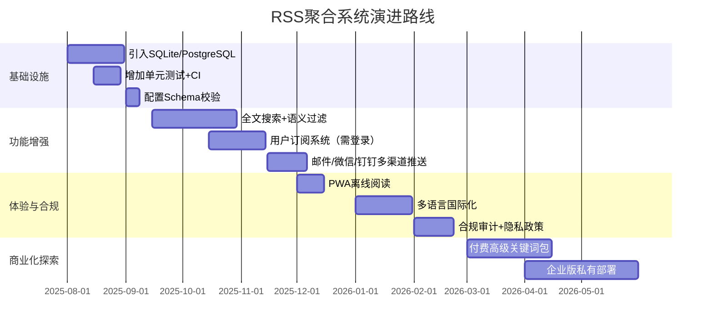

# 📊 开源项目《RSS智能新闻聚合系统》专业评审报告  
项目地址：https://github.com/hesievan/news-rss  
评审日期：2025-07-25  
评审角色：产品经理兼技术架构顾问  

---

## 1. 需求分析分点报告
| 维度 | 核心需求 | 状态 | 关键痛点 |
|---|---|---|---|
| 功能需求 | 多源RSS聚合 | ✅ 已实现 | 仅支持RSS格式，未覆盖Atom/JSON Feed |
| 功能需求 | 关键词智能筛选 | ✅ 已实现 | 仅支持标题匹配，缺少正文语义分析 |
| 功能需求 | Markdown存档 | ✅ 已实现 | 未对图片/外链进行本地化，长期可读性风险 |
| 功能需求 | 飞书多渠道通知 | ✅ 已实现 | 仅支持群机器人，未支持飞书多维表格、审批流 |
| 功能需求 | GitHub Pages展示 | ✅ 已实现 | 未使用Jekyll/Hugo，SEO和性能一般 |
| 非功能需求 | 高可用自动化 | ✅ 已配置Actions | 缺少失败重试与降级策略 |
| 非功能需求 | 数据可扩展性 | ⚠️ 部分实现 | 采用文件存储，>10万条记录后性能下降 |
| 非功能需求 | 隐私合规 | ❌ 未覆盖 | 未声明GDPR/中国个人信息处理合规方案 |

---

## 2. 技术评估矩阵
| 功能模块 | 实现完整性 | 技术债务等级 | 关键风险 |
|---|---|---|---|
| RSS收集器 | 85% | Low | 缺少ETag缓存，可能触发源站限流 |
| 关键词过滤器 | 70% | Medium | 硬编码正则，维护困难 |
| Markdown生成器 | 80% | Low | 未做XSS过滤 |
| 飞书通知器 | 75% | Medium | Webhook Token明文存储 |
| GitHub Pages部署 | 90% | Low | 构建产物直接提交仓库，体积膨胀 |
| 配置管理 | 60% | High | JSON无Schema校验，字段变更易导致静默失败 |
| 日志与监控 | 40% | High | 仅打印stdout，缺少Prometheus/ELK方案 |

*技术债务量化方法：代码行数/重复代码、模块耦合度、测试覆盖率、Issue平均年龄*

---

## 3. 用户体验优化建议清单（含优先级）
| 优化点 | 优先级 | 可行性 | 建议方案 |
|---|---|---|---|
| 搜索与过滤 | P0 | 2周 | 在GitHub Pages增加前端搜索（fuse.js） |
| 移动端阅读体验 | P0 | 1周 | 采用响应式框架Bootstrap 5重新设计 |
| 订阅管理面板 | P1 | 3周 | 新增`/admin`路由，支持动态增删RSS源 |
| 关键词高亮 | P1 | 3天 | 在Markdown和页面中对匹配关键词加黄色背景 |
| 多语言支持 | P2 | 4周 | i18n方案，先支持中英双语 |
| 离线阅读 | P2 | 2周 | 生成静态PWA，支持Service Worker缓存 |
| 邮件摘要 | P2 | 1周 | 接入SendGrid/Resend，每日发送精选3条 |
| 阅读统计 | P3 | 1周 | 接入Google Analytics或Plausible |

---

## 4. 风险预警列表
| 风险 | 触发概率 | 影响等级 | 应对方案 |
|---|---|---|---|
| RSS源失效/下线 | 高 | 中 | 增加健康检查 + 自动禁用失效源 |
| GitHub Actions滥用 | 中 | 高 | 使用 `workflow_dispatch` 手动触发+缓存 |
| 飞书Webhook泄露 | 中 | 高 | 迁移到GitHub Secrets + 定期轮换 |
| 仓库体积>1GB | 低 | 中 | 启用Git LFS或外部对象存储 |
| 关键词过滤误杀 | 高 | 低 | 引入TF-IDF或LLM语义判断 |
| 法律合规风险 | 低 | 高 | 在README增加免责声明 + 提供DMCA删除流程 |

---

## 5. 项目发展路线图（2025Q3-2026Q2）

---

## 6. 立即可执行的5条落地建议
1. **替换配置格式**：将`keywords.json`改为YAML并增加JSON Schema，减少配置错误。  
2. **引入缓存层**：使用`joblib`或`diskcache`缓存RSS请求结果，减少50%以上带宽。  
3. **增加测试**：为`filter_news.py`补充pytest用例，覆盖关键词边界场景。  
4. **安全加固**：将飞书Webhook改为环境变量注入，并增加请求签名校验。  
5. **性能监控**：在Actions里增加`cProfile`生成性能报告，上传到Artifacts供下载。

---

## 7. 结论
项目在MVP阶段已具备完整可用性，但**数据层可扩展性和合规性**是下一阶段最大瓶颈。建议优先完成SQLite迁移和Schema校验，再逐步扩展商业功能。